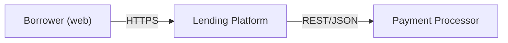
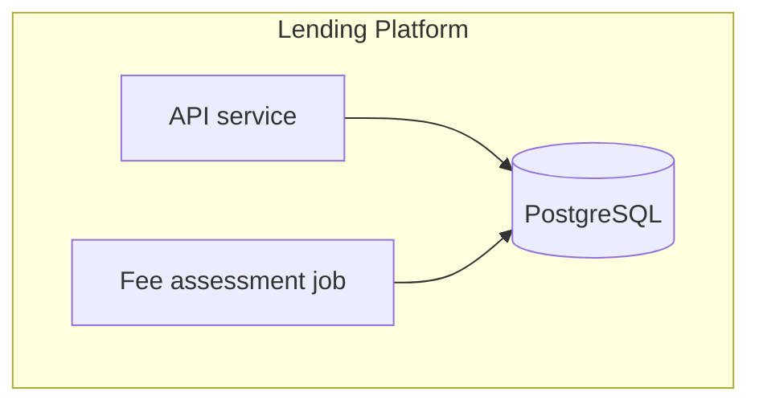
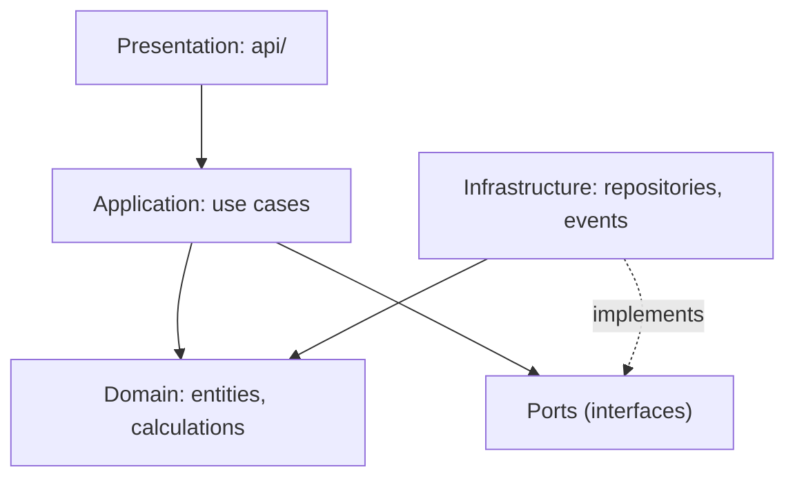
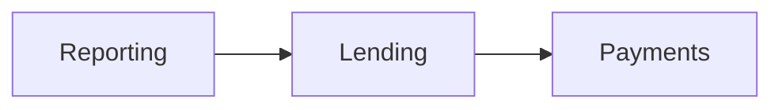
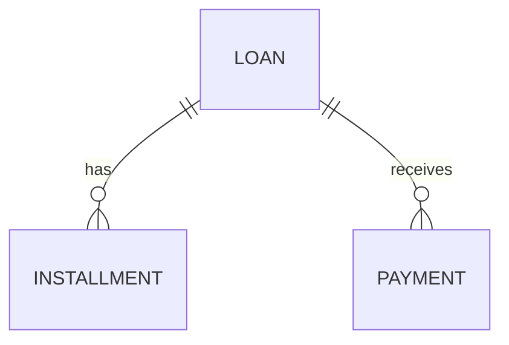
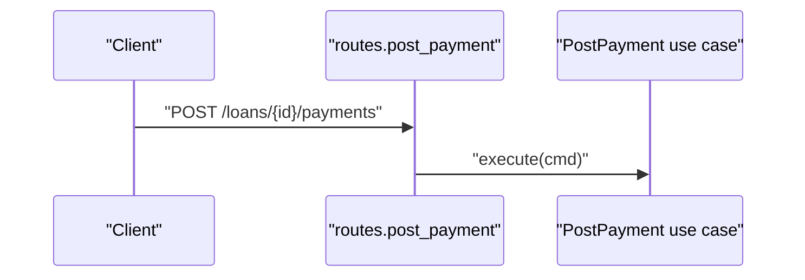

# Template: Architecture Overview (`03-architecture-overview.md`)

**Audience:** architects and developers.

**Source:** the system map, card "Interfaces" and "Data and state" sections,
the Phase 3 dependency graph, and verified pattern and layer claims.

**Voice:** precise and technical. Every structural claim links to code.

## Mermaid rules (portability)

The diagrams must render on GitHub, GitLab, VS Code, and Cursor previews.

- Use only `flowchart`, `sequenceDiagram`, `erDiagram`, `stateDiagram-v2`, and
  `classDiagram`. Mermaid's C4 support is experimental, so draw C4-style views
  with `flowchart` and `subgraph`.
- Use short alphanumeric node IDs and put labels in double quotes:
  `api["HTTP API (FastAPI)"]`. Never use a reserved word (`end`, `graph`,
  `subgraph`, `class`) as a bare ID.
- Don't put parentheses, brackets, or `:`/`;` in labels unless the label is
  quoted.
- Keep each diagram under about 25 nodes. Split big systems into one context
  diagram plus one diagram per component.
- Label edges with what flows ("REST/JSON", "publishes PaymentPosted",
  "SQL").
- Every diagram gets a one-paragraph caption explaining it and naming the
  evidence behind it.

```markdown
# <System name>: Architecture Overview

> Generated by jy-codebase-analysis on <date> (commit <sha>). Reflects the
> code as built, which may differ from documented or intended architecture.

## Summary

<One paragraph: architectural style, main runtime units, data stores, and the
dominant integration style. Name the style only if the evidence supports it;
otherwise describe it.>

## Technology stack

| Concern | Technology | Version (if pinned) | Evidence |
|---|---|---|---|

## System context

<Who and what interacts with the system: people, external systems.>



## Runtime units (containers)

<Deployable or runnable units: services, workers, scheduled jobs, UIs,
databases, queues. Derived from build and deploy files and entry points.>



| Unit | Responsibility | Entry point | Talks to |
|---|---|---|---|

## Layers

<The layering as built: each layer's responsibility, what it may depend on,
and what it actually depends on. Include violations.>



| Layer | Contains | Allowed dependencies (evident intent) | Actual dependencies | Violations |
|---|---|---|---|---|

## Components

<For each major component: responsibility, public interface, key internal
modules, the data it owns, and its dependencies. Add a component diagram per
large component.>

### <Component>
- **Responsibility:** ...
- **Public interface:** ...
- **Owns data:** ...
- **Depends on:** ...
- **Evidence:** `path`

## Component dependencies



<Call out cycles and unexpected dependencies, with the import citation for
each.>

## Data model

<Core entities and relationships as persisted: tables, collections, or
aggregates. Mark whether this comes from schema/migrations (stated) or from
ORM models (stated), or was reconstructed from usage (inferred).>



## Key flows

<Two to four of the most important end-to-end flows, as sequence diagrams
following the actual call path, with each participant linked to code in the
caption.>



## Integrations

| External system | Protocol / mechanism | Direction | Where in code | Failure handling |
|---|---|---|---|---|

## Cross-cutting concerns

| Concern | Approach | Where | Consistency |
|---|---|---|---|
<Authentication and authorization, configuration, logging and observability,
error handling, transactions, caching, and resilience (retries, timeouts),
plus secrets handling. For secrets, give locations only and never values.>

## Architectural risks and observations

<Layer violations, dependency cycles, god modules, duplicated logic across
components (link to the Business Logic Catalog conflicts), tight coupling to
external SDKs, and missing boundaries. Each with evidence.>
```
