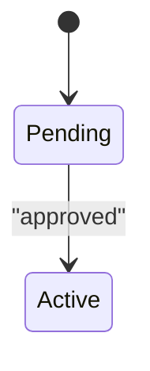

# Template: Business Logic Catalog (`02-business-logic-catalog.md`)

**Audience:** product managers, business analysts, and subject-matter experts,
plus developers who need to trace a rule to code.

**Source:** merged mechanically from the findings cards (rules R-…,
calculations C-…), the Phase 3 conflicts (X-…), and verification results.
**Do not summarize rules away**: every verified rule and calculation appears
here. Refuted claims are left out. Corrected claims appear in their corrected
form.

**Organization:** by **business capability** (for example Origination,
Payments, Fees, Reporting), not by file or layer. Within a capability, list
calculations first, then rules ordered by impact.

**IDs:** assign stable catalog IDs (`BL-1`, `BL-2`, …) and keep the source
card IDs in each entry for traceability.

**Voice:** each entry leads with a plain-language statement a PM can read on
its own. Precision (formula, boundaries, parameters) follows. Code references
come last.

```markdown
# <System name>: Business Logic Catalog

> Generated by jy-codebase-analysis on <date> (commit <sha>). <N> rules and
> <M> calculations across <K> business capabilities. <V> verified, <C>
> corrected during verification. Items marked *inferred* are interpretations
> that the code does not spell out.

## How to read this catalog

- **Calculations** state the math the system uses. The formula is the rule:
  changing it changes business outcomes.
- **Rules** state conditions and consequences, including exact boundaries.
- **Parameters** list hard-coded values and configurable settings separately.
  A hard-coded value can only change with a code change.

## ⚠ Conflicts and inconsistencies

<Every X- item from Phase 3, first, because these need a decision. For each:
the concept, which implementations disagree and how, the business
consequence, where each is used, and the question for SMEs. Include
code-vs-documentation and code-vs-test disagreements here too.>

### X-1 — <concept> is calculated differently in <k> places
- **What differs:** ...
- **Business consequence:** ...
- **Used where:** ...
- **Decision needed:** ...
- **Evidence:** `path:line`, `path:line`

## Parameters and policy values

| Parameter | Value | Business meaning | Hard-coded or configurable | Where defined | Used by |
|---|---|---|---|---|---|
<Every rate, threshold, cap, floor, grace period, and limit found. PMs often
want this table more than anything else.>

## <Business capability 1>

<One-paragraph overview of this capability's logic.>

### BL-1 — <Calculation name> *(calculation · high impact)*

**In plain terms:** <one or two sentences>

**Formula:**
```
<formula in plain notation, in code order, including rounding steps>
```

| Symbol | Meaning | Unit | Source |
|---|---|---|---|

- **Rounding and precision:** ...
- **Conventions:** <day count, compounding, and so on>
- **Edge cases:** ...
- **Worked example:** <inputs → steps → result>
- **Verified:** yes / corrected / sampled-out
- **Where in code:** `path:start-end` (source: C-004-2) · tests: `path:line`

### BL-2 — <Rule name> *(eligibility · high impact)*

**In plain terms:** <one or two sentences>

- **Applies when:** <exact conditions, boundaries explicit>
- **Outcome:** ...
- **Exceptions:** ...
- **Parameters:** <link to the parameters table>
- **Verified:** ...
- **Where in code:** `path:line` (source: R-007-1)

## <Business capability 2>
...

## Lifecycle and status rules

<Consolidated state machines for key entities (for example loan status or
order status). Use a Mermaid state diagram plus a table of transitions with
their guard conditions and triggering actors.>



## Anomalies relevant to business behavior

<Suspected bugs and dead rules from the cards that affect business outcomes,
each labeled as suspected, with its evidence. Keep code-quality-only
anomalies out; those belong in the engineering report.>

## Open questions

| # | Question | Why it matters | Related entries |
|---|---|---|---|
```
